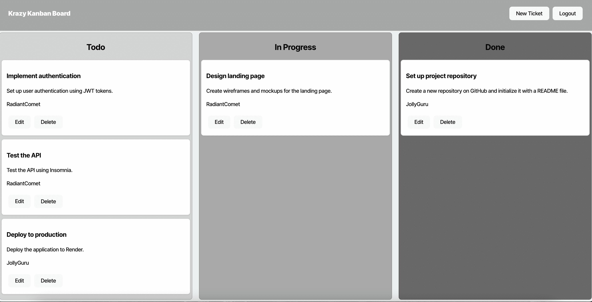
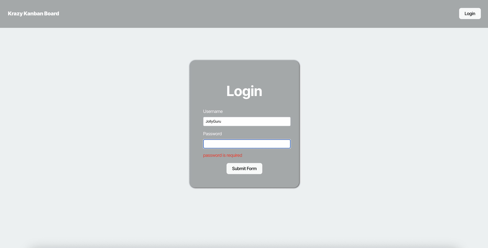
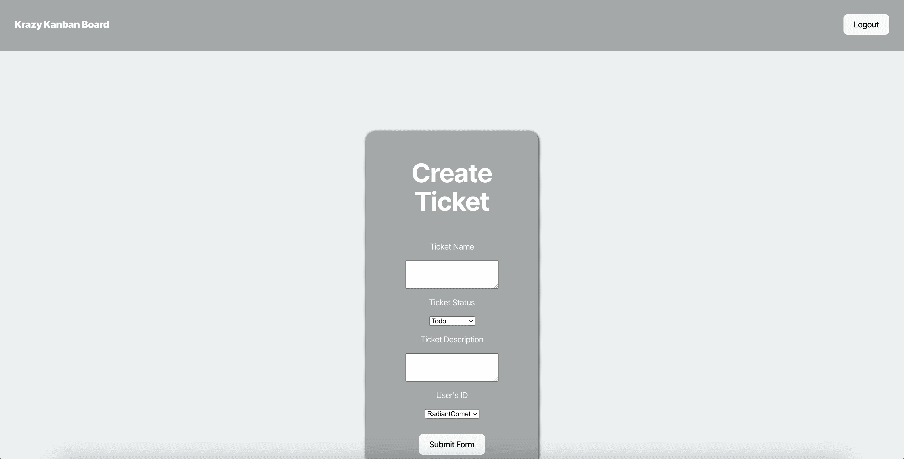

# Kanban Board

## Description

This Kanban board application is a modern task management tool that helps users organize and track their work through an intuitive drag-and-drop interface. Built with React and TypeScript, it features a responsive design and real-time updates. The application allows users to create, manage, and track tasks across different stages of completion, making it perfect for both individual productivity and team collaboration.

## Table of Contents

-   [Usage](#usage)
-   [Contributing](#contributing)
-   [Questions](#questions)
-   [Credits](#credits)
-   [Preview](#preview)

## Usage

To use this application, simply goto [https://kanban-board-2dzw.onrender.com/](https://kanban-board-2dzw.onrender.com/)

## Contributing

Contributions are welcome. Please submit a pull request or open an issue for any feature requests or bugs.

## Questions

For any questions, please contact me on GitHub at [mazagri3](https://github.com/mazagri3).

## Credits

Credits: This project was developed as part of a coding bootcamp assignment. Special thanks to the bootcamp instructors and mentors for their guidance.

## Preview

